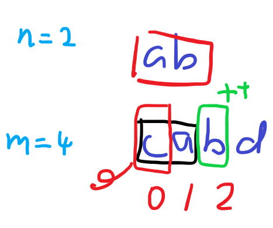

## 567.字符串的排列

`s1`的长度一定是固定的，他的大小`n`作为窗口大小。

`Arrays.equal()`可以直接比较数组

`s2`当前窗口生成**字典**，如果与`s1`的数组相等，返回true；

否则，将窗口右的字符放入字典，窗口左的字符移出字典。



```
class Solution {
    public boolean checkInclusion(String s1, String s2) {
        int n = s1.length(); //window's size
        int m = s2.length();   
        if(n > m)
            return false;
        
        int[] arr1 = new int[26];
        int[] arr2 = new int[26];
        for(int i=0; i < n; i++){
            arr1[s1.charAt(i) - 'a']++;
            arr2[s2.charAt(i) - 'a']++;
        }
        if(Arrays.equals(arr1, arr2))
            return true;
 
        for(int i=n; i < m; i++){
            arr2[s2.charAt(i) - 'a']++;
            arr2[s2.charAt(i-n) - 'a']--;
            if(Arrays.equals(arr1, arr2))
                return true;          
        }
        return false;
    }
}
```
